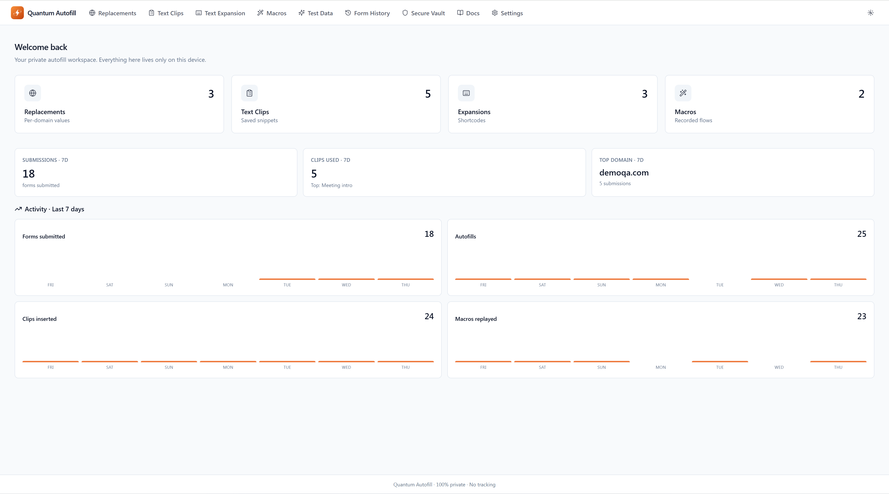
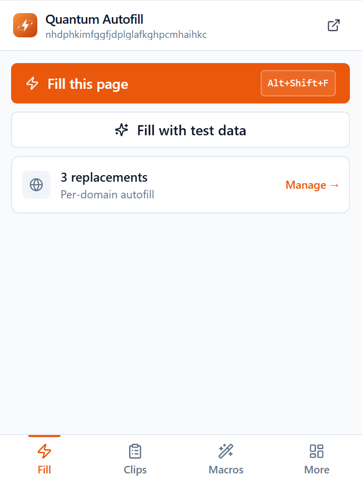
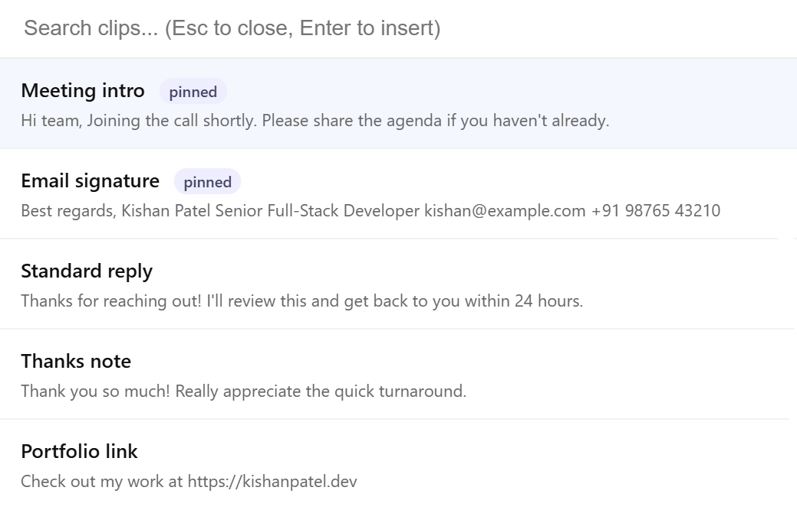

# Quantum Autofill

### Quantum-fast autofill. Zero data leaves your device.

A privacy-first browser extension that combines smart autofill, text expansion, macros, a clip library, fake-data generation, form history, and an encrypted vault — all stored only on your device.

---

## Pricing

**Free.** Every feature, no accounts, no ads, no tracking.

## Features

| Module | What it does |
|---|---|
| **Replacements** | Per-URL field values that auto-fill matching pages on load. |
| **Text Clips** | Reusable snippets inserted via popup, right-click menu, or in-page overlay (`Alt+C`). |
| **Text Expansion** | Type a shortcode anywhere; expands inline as you type. |
| **Macros** | Record clicks + typing on any page, replay with one click. |
| **Test Data** | Realistic sample data for QA engineers and developers testing their own forms. |
| **Form History** | Auto-logs every submitted form (passwords excluded). Searchable. |
| **Secure Vault** | Encrypted local storage for sensitive values. Master-password protected. |
| **Backup & Restore** | Single-file JSON export of all your data. |

## Screenshots

<table>
<tr>
<td width="50%"><b>Popup</b></td>
<td width="50%"><b>In-page clip picker (<code>Alt+C</code>)</b></td>
</tr>
<tr>
<td></td>
<td></td>
</tr>
</table>

## Privacy

- All autofill data, clips, macros, and vault entries stay on your device.
- No telemetry, no analytics, no advertising.
- Full privacy policy → [privacy.html](https://kishanpatel385.github.io/quantumautofill/privacy.html)

## Contact

🌐 [quantumfill website](https://kishanpatel385.github.io/quantumautofill/)
📧 kishanpatel385@gmail.com
🔗 [LinkedIn](https://www.linkedin.com/in/kishanpatel385)

## License

See [LICENSE](./LICENSE). © 2026 — all rights reserved.
